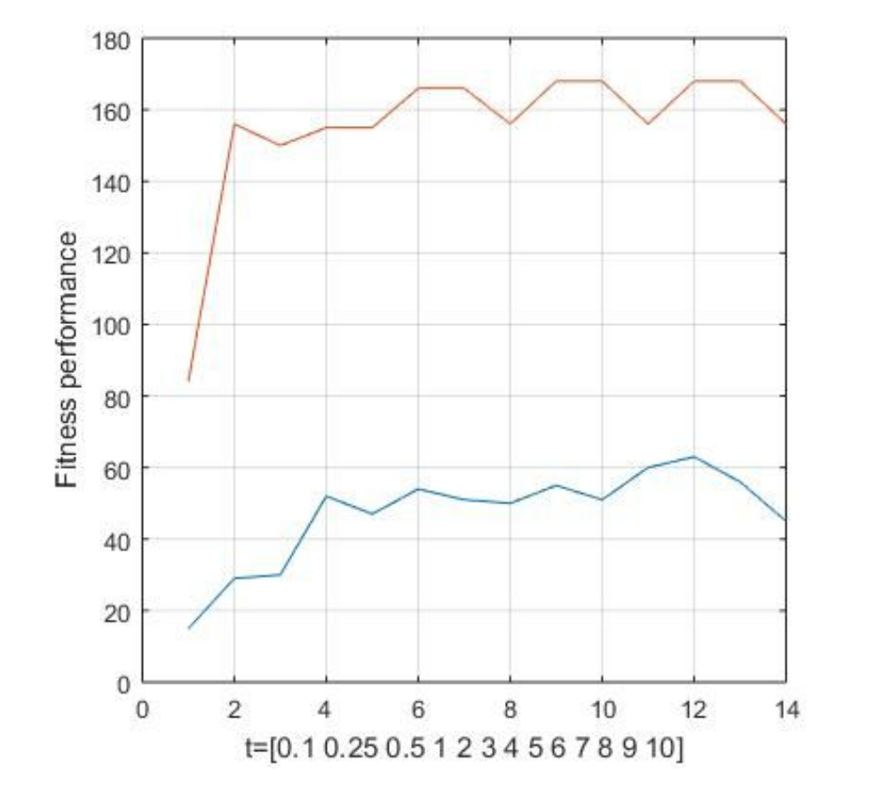

# Urban-Planning
A C++ application that given a map of a city and the type of buildings, it optimizes the layout based on different given conditions. It uses a Genetic Algorithm to optimize the model.


## Problem Description
For this problem, you will use hill climbing and genetic algorithms to determine the ideal locationof industry, commerce, and residential sections a city.You will input a map with the following symbols:

- X: former toxic waste site. Industrial zones within 2 tiles take a penalty of -10. Commercial and residential zones within 2 tiles take a penalty of -20. You cannot build directly on a toxic waste site.
- S: scenic view. Residential zones within 2 tiles gain a bonus of 10 points. If you wish,you can build on a scenic site but it destroys the view.
- 0...9: how difficult it is to build on that square. You will receive a penalty of that many points to put anything on that square. You will have to place industrial, residential, and commercial tiles on the terrain.
- Industrial tiles benefit from being near other industry. For each industrial tile within 2, there is a bonus of 3 points.
- Commercial sites benefit from being near residential tiles. For each residential tile within 3 squares, there is a bonus of 5 points However, commercial sites do not like competition. For each commercial site with 2 squares, there is a penalty of 5 points.
- Residential sites do not like being near industrial sites. For each industrial site within 3 squares there is a penalty of 5 points. However, for each commercial site with 3 squares there is a bonus of 5 points.

**Note** that all distances uses the Manhattan distance approach. So distance is computed in
terms of moves left/right and up/down, not diagonal movement

## Program Behavior of Genetic Algorithm 
The genetic algorithm works in such way that it randomizes the the inputted building on the map and codes their location in a gene based on the distance between the buildings. So every gene represents a random design of the buildings on the map. And for every generation it uses the techniques of Elitism, Mutation, and Crossover , in order to optimize the score, which is generated as described above. The Elitism is passing automatically on the next generation the individuals with the highest scores. Mutation chooses an individual randomly from the
population and randomly changes one part of its gene. Finally crossover uses the tournament method for as a selection method in order to perform crossover. In our case the crossover is done by selecting two groups of three individuals from each group we select the most fit individual and then we randomly crossover the two individuals. Elitism, mutation and crossover affect the performance of the algorithm, thus, in order to make the Genetic algorithm faster we need to find the best values for this parameters. Specifically elitism, introduces a bias in the population so it would be preferable to use small percentages of elitism.


*The following figure shows the performance of the genetic algorithm (in blue) and the Hill climbing algorithm (in red) with different running time.*



Based on the performance of the algorithms, the best option is using Hill Climbing in we have only 0.25s. The Genetic algorithm needs more time to converge so it would be preferable for longer time, in our case though for only ten seconds hill climbing performs better, that is due to our high population.

## How to run the program 

The input of the program is a txt file, followed by GA for genetic algorithm or HC for Hill Climbing algorithm.

The output of the program is to print out the following information: 
1) Type of Algorithm used
2) Time consumed
3) Number of iterations
4) Final map
5) Resulting Score

In order to make the program, once you are in the same directory with all the files type in the linux terminal:

> make

Then you are ready to run the program.

### Example Input: 


> ./urbanplanning example.txt GA

### Example Output: 
```
Calculating the best configuration. Please wait .............

Simulation finished after 10033 ms **********************************

S T A T I S T I C S   O F   T H E   S I M U L A T I O N:

  Algorithm: Genetic Algorithm
  Selection Method: TOURNAMENT
  Crossover Method: RANDOM
  Population:128
  %Elitism: 10% 	 %Mutations: 18%	%Crossover:72%

  Max_Iterations: 10000	Iterations:267

--------- Resulting Map ---------

  . . I . . . . .
  . . I . . . . .
  . . . . . . S I
  . . . . R . . C
  . X . S . . . .
  . . R . C . . .
  . . S . . . . X
  . . S C R . . .

  Score: 63


fitness.txt Generated!: Log of fitness
behavior.txt Generated!: Log of iterations

Exiting of the simulation...

```
